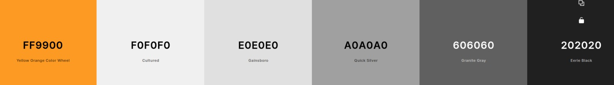

# BITCOIN ELI5
### Bitcoin Explained Like I’m Five (ELI5)

# URL to live website
[https://gracious-hugle-f2aeb7.netlify.app/index.html](https://gracious-hugle-f2aeb7.netlify.app/index.html)
# Summary
### Project One-Liner 
This is an educational website meant to spread blockchain awareness (without dishing out financial advice). It focuses on Bitcoin as the most common example of a blockchain. 
### Context and Justification
Many people fear cryptocurrencies, even Charlie Munger of Berkshire says 
>“Bitcoin Nearly as Bad as ‘Trading Harvested Baby Brains’”. 

Yet, the blockchain industry aka Web 3.0 has now grown to a $2 trillion industry in 2022 despite all the negative press.

Blockchain is often likened to the internet - at inception, many people made famous incorrect predictions about the role that the Internet would play in our lives. Even Robert Metcalfe, who invented Ethernet, predicted that the Internet will collapse one day. These negative, fear-mongering statements often lead to misconceptions in society about the nature of cryptocurrencies. 

For new entrants, the first thing when they google Bitcoin is “Bitcoin is a digital, peer-to-peer decentralized currency that can be exchanged without intermediaries”. This statement is often unhelpful and off-putting for people just wanting to read up a little more to broaden their knowledge. 

This project aims to dispel some of the myths surrounding cryptocurrencies, and generally, blockchains and delves into the technical aspect of how they work - with data visualization.

# 5 Planes of Design 
## Target audience group:
### Non-Technical people with no blockchain knowledge but are curious
**Age:** 16 onwards 

**Occupation:** Students, Working Adults from all walks of life

**Educational Level:** Secondary to Tertiary

**IT Literacy Level:** Able to use computers with varying proficiency

**Goals:** 
Want to learn how to make money off blockchain
Specifically, they want to know what are Bitcoin, Ethereum, Blockchain and Cryptocurrencies
Want to know how to use the blockchain

**Considerations:**
No exposure to blockchain jargon from the get-go, need to ease them slowly. 
Learning pedagogy needs to be simple and plenty of examples.
Give them insights about how to make money off cryptocurrencies

### Non-Technical people with basic blockchain knowledge and want to learn more
**Age:** 16 onwards 

**Occupation:** Investors, Traders, Speculators, Finance Industry

**Educational Level:** Secondary to Tertiary

**IT Literacy Level:** Able to use computers with varying proficiency

**Goals:**
Want to learn something new that they don’t know prior

**Considerations:**
Should allow them to learn something new despite their prior blockchain knowledge
Delve into more esoteric topics that they probably have not heard of about blockchains (Like AMMs, DeFi)

### Technical people
**Age:** 16 onwards 

**Occupation:** STEM Occupations

**Educational Level:** Tertiary

**IT Literacy Level:** Proficient at computers and familiar with computing concepts

**Goals:** 
Want to know the more technical aspects of blockchain

**Considerations:**  
Information presented needs to be technically accurate
Can handle more complex concepts which will give them better understanding

## UI/UX:
### User Stories
- As a working (in a non-technical field) adult with little time and no prior knowledge about cryptocurrencies, I want to learn more about them so that I can decide whether to invest in them.
Acceptance Criteria
Quick and succinct in knowledge delivery
Non-technical, gentle introduction of jargon

- As an adult who has heard much negative news about cryptocurrencies but didn’t do any prior read-up, I want to open my mind once again to them so that I understand why some of my friends are so upbeat about cryptocurrencies. 
Acceptance Criteria
Dispel negative myths in a transparent manner
Non-biased delivery of information
Non pushy narrative

- As an adult who has already bought cryptocurrencies, I think I know plenty about cryptocurrencies. I want to see if there is anything more I can learn so that I can broaden my knowledge
Acceptance Criteria
Delving into technical aspects which most people rarely touch
Delving into more exotic topics

### Special considerations:
Due to the jurisdiction in which the website is created in, there should be no financial advice whatsoever. 
## Content & Features:

### Webpages

- ### Index Page
A way to access all 6 webpages from the landing page. 

- ### History
A discussion about the history of bitcoin in vertical timeline format, with a nice big price chart of Bitcoin being the anchor. The price chart can toggle between logarithmic, and candle, and also varying timespans. 

- ### Security
This is a Single Page Application (SPA) arranged in slide style, with examples on hashing, digital signatures, wallet generation and blockchain simulation. However, due to lack of time, this section is unable to be completed past digital signatures. 

- ### Scarcity
A discussion about mining and the circulating supply of Bitcoin, with an anchor supply chart at the top, zoomable, and with a reset zoom feature. Tables comparing the difference between Bitcoin and Gold

- ### Decentralization
An anchor map that lists all of the active Bitcoin nodes currently active, and discusses why does running nodes contribution to decentralization. The map should be able to cluster nodes based on human geography. 
- ### Dashboard
A one-stop dashboard that allows users to view handy data about Bitcoin. Resizable widgets that can be dragged and dropped in any configuration the user wants for their own specific needs. Widgets can also be closed. If the user ever needs to reset the layout, there is a reset button. 

## Design

### Wireframe

Hand Drawn, lost/missing unfortunately

### Color Palette

[Color Palette Link](https://coolors.co/ff9900-f0f0f0-e0e0e0-a0a0a0-606060-202020)

The choice of color was primarily based on a black and white theme, black background with white fonts, and a sprinkling of Bitcoin default gold color. 

### Font Palette

The following choices of font were made. 

Header: `font-family: 'Fredoka', sans-serif;`

Sub-Header: `font-family: 'Nunito', sans-serif;`

Body: `font-family: 'Source Code Pro', monospace;`

Chart Font: `font-family: 'Source Sans Pro', sans-serif;`

Attention: `font-family: 'Tourney', cursive;`

### API Endpoints
Node Data with Grographical Coordinates: 

https://bitnodes.io/api/v1

Bitcoin Blockchain Data:

https://blockchain.info

https://api.blockchain.info

Prices Data:

https://bitnodes.io/api/v1

https://api.coingecko.com/api/v3

### Technologies Used

## Used in all 6 sites in various ways
- HTML5
- CSS3
- JavaScript
- Bootstrap v5.1
- Font Awesome
- Google Fonts

## Used in production
- Visual Studio Code
- Git
- GitHub
- Netlify

## Used for widgets in dashboard.html and others
- Leaflet
- Leaflet Marker Clustering

Node maps, charts
- Apex Charts

Used 9 times in dashboard.html
- Axios

Used 17 times in dashboard.html

# TEST CASES
| #  | Description | Steps | Expected|
| ------------- | ------------- | ------------- | ------------- |
||In History.html|In History.html|In History.html|
| 1 | Bitcoin Price Chart must be able to load  | Load Site, wait for chart to appear | Check the graph against https://www.coingecko.com/en/coins/bitcoin to see if it matches (Max) |
| 2 | Logarithmic Button switches data to logarithmic  | Click logarithmic button | Check against https://www.coingecko.com/en/coins/bitcoin, logarithmic chart  |
| 3 | Candle button switches chart to candlestick | Click candlestick button   | Check against https://www.coingecko.com/en/coins/bitcoin, candle chart |
| 4 | Timespan buttons switches to the correct data  | Change timespan, check against https://www.coingecko.com/en/coins/bitcoin, select date | Days selected matches the x-axis of the chart |
| 5 | While clicking buttons, logarithmic and candle settings are applied | Click on a new timespan  | Check if the same logarithmic and candle settings are still applied   |
||In Dashboard.html|In Dashboard.html|In Dashboard.html|
| 1 | All 19 Widgets, from left to right, top to bottom | Wait for it to load  | Check if all widgets are displaying something  |
| 2 | Widget 1 (Current Block) | Should display latest block  | Check against https://www.blockchain.com/explorer, under Latest Blocks  |
| 3 | Widget 2 (Last Block) | (1 minute refresh rate)  | Check against https://www.blockchain.com/explorer, make sure the time elapsed is the same  |
| 4 | Widget 3 (Avg block time) | (1 minute refresh rate)  | Match https://blockchain.info/q/interval in seconds |
| 5 | Widget 4 (Network Hashrate) | (1 minute refresh rate)  | Match https://api.blockchain.info/stats hash_rate, where we add 18 zeros  |
| 6 | Widget 5 (Price) | (1 second refresh rate)   | Match market price at https://www.binance.com/en/trade/BTC_USDT  |
| 7 | Widget 6 (Block List) | (1 minute refresh rate) | Match Latest Blocks at https://www.blockchain.com/explorer?utm_campaign=expnav_explorer  |
| 8 | Widget 6 (Block List) | Click on any block height number  | Widget 11 should change to the transaction list for that block, verify by checking https://www.blockchain.com/explorer?utm_campaign=expnav_explorer and clicking on the same block  |
| 9 | Widget 11 (Tx List)  | Click on any of the transactions listed, Widget 12 should update with the transaction details of that transaction  | Check against https://www.blockchain.com/explorer?utm_campaign=expnav_explorer, by going to that block number, and finding the transaction |
| 11 | Widget 7 (avg transaction per block chart)  | Wait for chart to load  | Chart should match https://www.blockchain.com/charts/n-transactions-per-block |
| 12 | Widget 8 (Hashrate Distribution) | Wait for chart to load   | Should Match https://www.blockchain.com/charts/pools |
| 13 | Widget 9 (Daily Network Hashrate) | Wait for chart to load  | Should Match https://www.blockchain.com/charts/hash-rate  |
| 14 | Widget 10 (Orderbook) | Updates every second  | Should match the orderbook of https://www.binance.com/en/trade/BTC_USDT  |
| 15 | Widget 13 (Price) | Wait for chart to load   | Should match the 90 day chart at https://www.coingecko.com/en/coins/bitcoin |
| 16 | Widget 14 (Candlestick)  | Wait for chart to load   | Should match the candlechart at https://www.binance.com/en/trade/BTC_USDT, set graph to 30 mins  |
| 17 | Widget 15 (Live price)  | Wait for chart to update  | Updated value must match the price at widget 5 |
| 18 | Widget 16 (Node Map)  | Clustering based on continent, then zoom in, then cluster by countries, then zoom in, then cluster by cities, then zoom in, then cluster by location, then zoom in to see individual nodes  | Check that there are no irregularities  |
| 19 | Widget 16 (Node Map)    | Each node, when clicked on, should show details about the node  | Check node data against https://bitnodes.io/   |
| 20 | Widget 13, 17, 18  | Hover mouse on one of their charts | All 3 charts should be synchronized   |
| 21 | Widget 19 (Exchange Data) | When table loads  | Check against https://www.coingecko.com/en/coins/bitcoin#markets  |
| 22 | Widget 19 (Exchange Data)  | Click on any of the exchange in the row | A new tab should pop up, leading you to that exchange  |
|23| All widgets| All widgets are resizable and movable| Check for that
|24| All widgets| All widgets will have the highest z index when last clicked on| check for that
||In Decentralization.html|In Decentralization.html|In Decentralization.html|
| 1 | Node Map  | Clustering based on continent, then zoom in, then cluster by countries, then zoom in, then cluster by cities, then zoom in, then cluster by location, then zoom in to see individual nodes  | Check that there are no irregularities  |
| 2 | Node Map    | Each node, when clicked on, should show details about the node  | Check node data against https://bitnodes.io/ |

# Deployment
Hosted on Netlify free plan, without database. All dependencies are delivered via CDN. 
To deploy, fork this code, link your Github account with netlify, and make this repo a site. 

# Dependencies
- Bootstrap v5.1
- Font Awesome
- Google Fonts
- Leaflet
- Leaflet Marker Clustering
- Apex Charts
- Axios

# CREDITS AND ACKNOWLEDGMENT
- Visual Studio Code
- Git
- GitHub
- Netlify
- HTML5
- CSS3
- JavaScript
- Bootstrap v5.1
- Font Awesome
- Google Fonts
- Leaflet
- Leaflet Marker Clustering
- Apex Charts
- Axios
- Last but not least, Trent Global College and their excellent teacher, Paul.
- Also my wife.
- And Family
